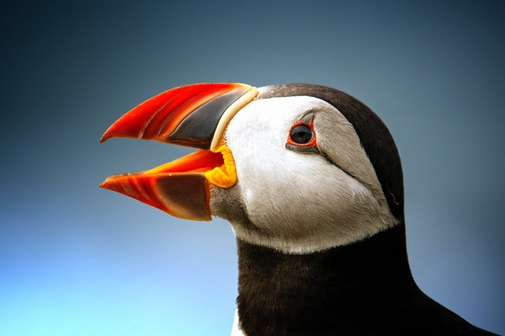

# Real life example

``` r

library(lightr)
```

This vignette has two goals:

- demonstrate that `lightr` parsers produce the same output as the
  official software
- show an example of analysis you can run once you’ve imported your data
  with `lightr`

For this, we use spectral data of the beak of the [atlantic puffin,
*Fratercula arctica*](https://en.wikipedia.org/wiki/Atlantic_puffin).
This data was collected by Dr Claire Doutrelant, using an OceanOptics
spectrometer.

``` r


```


Atlantic puffin close up, by user john-289283 from pexels.com

## Comparison of outputs

By default, OceanOptics spectrometers produce `.ProcSpec` files, which R
cannot readily import. To help with this, OceanOptics official software,
SpectraSuite has a conversion feature, which turns `.ProcSpec` files
into tab separated values files (`.txt`).

So, let’s start by comparing the `.ProcSpec` spectra imported by
`lightr` and the `.txt` files produced by OceanOptics.

``` r

raw_files <- lr_get_spec(file.path("data", "puffin"), ext = "ProcSpec")
#> 2 files found; importing spectra:
txt_files <- lr_get_spec(file.path("data", "puffin"), ext = "txt")
#> 2 files found; importing spectra:
```

We can visually inspect these two file using the dedicated S3 function
[`pavo::plot.rspec()`](https://pavo.colrverse.com/reference/plot.rspec.html):

``` r

library(pavo)
plot(raw_files, main = "Raw ProSpec files")
plot(txt_files, main = "Exported txt files")
```


Spectra imported by `lightr` and converted by SpectraSuite look pretty
similar upon visual inspection and we can confirm this with

``` r

all.equal(raw_files, txt_files, tol = 1e-4)
#> [1] TRUE
```

## Example of analysis

One possibly biologically relevant question would be to look at the
interspecific variability in beak colour. *I.e.*, do all puffin
individuals have roughly the same colour or are some individuals
brighter, more colourful than others?

For this, we will look at the difference in hue and brightness on the
red part of the beak for two individuals, with
[`pavo::summary.rspec()`](https://pavo.colrverse.com/reference/summary.rspec.html)
function (after smoothing with
[`pavo::procspec()`](https://pavo.colrverse.com/reference/procspec.html)):

``` r

beak <- procspec(raw_files, opt = "smooth")
#> processing options applied:
#> smoothing spectra with a span of 0.25
summary(beak, subset = c("B2", "H5"))
#>                 B2  H5
#> BR_PF26_1 26.23823 569
#> BR_PF27_3 21.78785 581
```

Okay, these two individuals seem to differ quite a lot in terms of hue
and brightness. Now, one might ask if these difference can be perceived
in bird vision. We can test this with the
[`pavo::coldist()`](https://pavo.colrverse.com/reference/coldist.html)
function.

``` r

vis_beak <- vismodel(beak, visual = "avg.uv", achromatic = "ch.dc")
tcs_beak <- colspace(vis_beak)
coldist(tcs_beak, achromatic = TRUE)
#> Quantum catch are relative, distances may not be meaningful
#> Calculating unweighted Euclidean distances and Weber luminance contrast
#>      patch1    patch2          dS        dL
#> 1 BR_PF26_1 BR_PF27_3 0.005867583 0.2004935
```

The values of `dS` and `dL` are below the 1 JND ([just noticeable
differences](https://en.wikipedia.org/wiki/Just-noticeable_difference))
threshold, which means that the colour of the two individuals, in spite
of their difference, looks the same to the birds.
